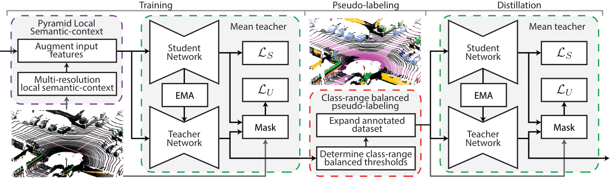

# Scribble-Supervised LiDAR Semantic Segmentation
Dataset and code release for the paper [**Scribble-Supervised LiDAR Semantic Segmentation**](https://arxiv.org/abs/2203.08537), CVPR 2022 (ORAL). <br>
**Authors**: Ozan Unal, Dengxin Dai, Luc Van Gool <br>

**Abstract**: Densely annotating LiDAR point clouds remains too expensive and time-consuming to keep up with the ever growing volume of data. While current literature focuses on fully-supervised performance, developing efficient methods that take advantage of realistic weak supervision have yet to be explored. In this paper, we propose using scribbles to annotate LiDAR point clouds and release ScribbleKITTI, the first scribble-annotated dataset for LiDAR semantic segmentation. Furthermore, we present a pipeline to reduce the performance gap that arises when using such weak annotations. Our pipeline comprises of three stand-alone contributions that can be combined with any LiDAR semantic segmentation model to achieve up to 95.7% of the fully-supervised performance while using only 8% labeled points.


---

### News
**\[2022-08\]** Leaderboard available [here](https://paperswithcode.com/sota/3d-semantic-segmentation-on-scribblekitti), make sure you submit your validation set results! <br>
**\[2022-04\]** We release our training code with the Cylinder3D backbone. <br>
**\[2022-03\]** Our paper is accepted to **CVPR 2022** for an **ORAL** presentation! <br>
**\[2022-03\]** We release ScribbleKITTI, the first scribble-annotated dataset for LiDAR semantic segmentation. <br>

---

## ScribbleKITTI


We annotate the train-split of [SemanticKITTI](http://semantic-kitti.org/) based on [KITTI](http://www.cvlibs.net/datasets/kitti/eval_odometry.php) which consists of 10 sequences, 19130 scans, 2349 million points. ScribbleKITTI contains 189 million labeled points corresponding to only 8.06% of the total point count. We choose SemanticKITTI for its current wide use and established benchmark. We retain the same 19 classes to encourage easy transitioning towards research into scribble-supervised LiDAR semantic segmentation.

Our scribble labels can be downloaded [here](https://data.vision.ee.ethz.ch/ouenal/scribblekitti.zip) (118.2MB).

### Data organization

The data is organized in the format of SemanticKITTI. The dataset can be used with any existing dataloader by changing the label directory from `labels` to `scribbles`.

```
sequences/
    ├── 00/
    │   ├── scribbles/
    │   │     ├ 000000.label
    │   │     └ 000001.label
    ├── 01/
    ├── 02/
    .
    .
    └── 10/
```

---

## Scribble-Supervised LiDAR Semantic Segmentation



We develop a novel learning method for 3D semantic segmentation that directly exploits scribble annotated LiDAR data. We introduce three stand-alone contributions that can be combined with any 3D LiDAR segmentation model: a teacher-student consistency loss on unlabeled points, a self-training scheme designed for outdoor LiDAR scenes, and a novel descriptor that improves pseudo-label quality.

Specifically, we first introduce a weak form of supervision from unlabeled points via a consistency loss. Secondly, we strengthen this supervision by fixing the confident predictions of our model on the unlabeled points and employing self-training with pseudo-labels. The standard self-training strategy is however very prone to confirmation bias due to the long-tailed distribution of classes inherent in autonomous driving scenes and the large variation of point density across different ranges inherent in LiDAR data. To combat these, we develop a class-range-balanced pseudo-labeling strategy to uniformly sample target labels across all classes and ranges. Finally, to improve the quality of our pseudo-labels, we augment the input point cloud by using a novel descriptor that provides each point with the semantic prior about its local surrounding at multiple resolutions. 

Putting these two contributions along with the mean teacher framework, our scribble-based pipeline achieves up to 95.7% relative performance of fully supervised training while using only 8% labeled points.

### Installation
For the installation, we recommend setting up a virtual environment:
```shell
python -m venv ~/venv/scribblekitti
source ~/venv/scribblekitti/bin/activate
pip install -r requirements.txt
```
Futhermore install the following dependencies:
- [torch-scatter](https://github.com/rusty1s/pytorch_scatter) (tested with version 2.0.5)
- [spconv](https://github.com/traveller59/spconv) (tested with version 1.2.1)

### Data Preparation
Please follow the instructions from [SemanticKITTI](http://www.semantic-kitti.org) to download the dataset including the KITTI Odometry point cloud data. Download our [scribble annotations](https://data.vision.ee.ethz.ch/ouenal/scribblekitti.zip) and unzip in the same directory. Each sequence in the train-set (00-07, 09-10) should contain the `velodyne`, `labels` and `scribbles` directories.

Move the `sequences` folder into a new directoy called `data/`. Alternatively, edit the `dataset: root_dir` field of each config file to point to the sequences folder.

### Training
The training of our method requires three steps as illustrated in the above figure: (1) **training**, where we utilize the PLS descriptors and the mean teacher framework to generate high quality pseudo-labels; (2) **pseudo-labeling**, where we fix the trained teacher models predictions in a class-range-balanced manner; (3) **distillation**, where we train on the generated psuedo-labels.

**Step 1** can be trained as follows. The checkpoint for the trained first stage model can be downloaded [here](https://data.vision.ee.ethz.ch/ouenal/training.ckpt). (The resulting model will show slight improvements over the model presented in the paper with 86.38% mIoU on the fully-labeled train-set.)
```bash
python train.py --config_path config/training.yaml --dataset_config_path config/semantickitti.yaml
```

For **Step 2**, we first need to first save the intermediate results of our trained teacher model. <br>
Warning: This step will initially create a save file `training_results.h5` (27GB). This file can be deleted after generating the psuedo-labels.
```bash
python save.py --config_path config/training.yaml --dataset_config_path config/semantickitti.yaml --checkpoint_path STEP1/CKPT/PATH --save_dir SAVE/DIR
```
Next, we find the optimum threshold for each class-annuli pairing and generate pseudo-labels in a class-range balanced manner. The psuedo-labels will be saved in the same root directory as the scribble lables but under a new folder called `crb`. The generated pseudo-labels from our model can be downloaded [here](https://data.vision.ee.ethz.ch/ouenal/crb.zip).
```bash
python crb.py --config_path config/crb.yaml --dataset_config_path config/semantickitti.yaml --save_dir SAVE/DIR
```

**Step 3** can be trained as follows. The resulting model state_dict can be downloaded [here](https://data.vision.ee.ethz.ch/ouenal/distillation_original.ckpt) (61.25% mIoU).
```bash
python train.py --config_path config/distillation.yaml --dataset_config_path config/semantickitti.yaml
```

### Evaluation
The final model as well as the provided checkpoints for the distillation steps can be evaluated on the SemanticKITTI validation set as follows. Evaluating the model is not neccessary when doing in-house training as the evaluation takes place within the training script after every epoch. The best teacher mIoU is given by the `val_best_miou` metric in W&B.

```bash
python evaluate.py --config_path config/distillation.yaml --dataset_config_path config/semantickitti.yaml --ckpt_path STEP2/CKPT/PATH
```

### Quick Access for Download Links:
- [Checkpoint of the trained model after step-1](https://data.vision.ee.ethz.ch/ouenal/training.ckpt) (427M).
- [Psuedo-labels generated in a class-range-balanced manner](https://data.vision.ee.ethz.ch/ouenal/crb.zip) (194M).
- [Checkpoint of the trained model after step-2](https://data.vision.ee.ethz.ch/ouenal/distillation_original.ckpt) (427M).
---

### Citation

If you use our dataset or our work in your research, please cite:

```bibtex
@inproceedings{unal2022scribble,
  title={Scribble-supervised lidar semantic segmentation},
  author={Unal, Ozan and Dai, Dengxin and Van Gool, Luc},
  booktitle={Proceedings of the IEEE/CVF Conference on Computer Vision and Pattern Recognition},
  pages={2697--2707},
  year={2022}
}
```

### Acknowledgements
We would like to additionally thank the authors the open source codebase [Cylinder3D](https://github.com/xinge008/Cylinder3D).
